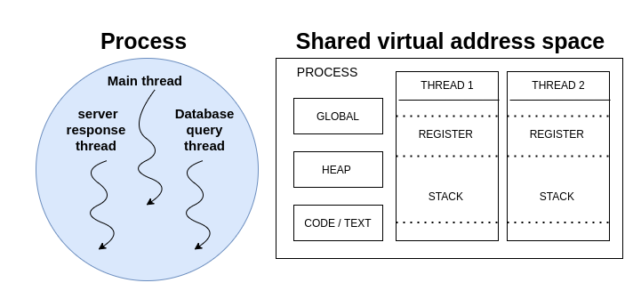
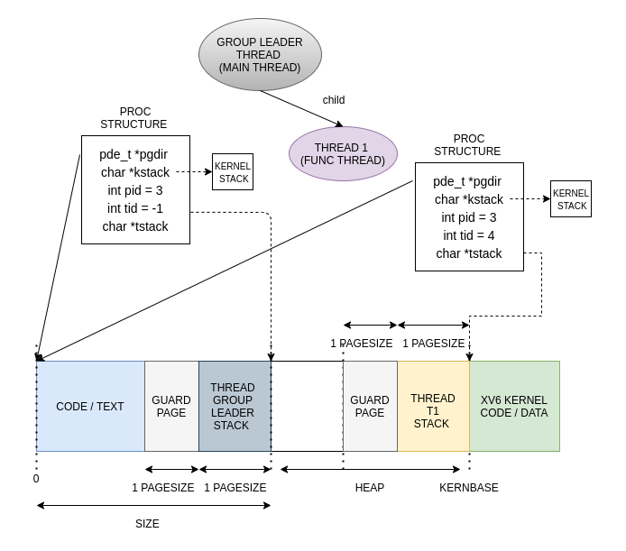

# xv6 Kernel Threads

* **Kernel level support for threads (light weight processes) along with user land 
   threading library as wrapper for creating threads and semaphore
   implementation as synchronization primitive.** 

## xv6 memory management layout 

* xv6 uses 2 level **hierarchical paging technique** for memory management. 
  Each process is associated with page directory containing entries of page 
  tables which contain phyical address of pages allocated to process 

* xv6 allocates pages to the following part of the process in with below order
    
    ```text
            +-----------------------+
            |      KERNEL CODE      |
            +-----------------------+ <----- KERNBASE 
            |                       |
            |          heap         |
            |                       |
            +-----------------------+ <----- size 
            |         stack         | 
            +-----------------------+
            |      guard page       |
            +-----------------------+
            |       text/code       |
            +-----------------------+ <----- 0 
    ```

* Note xv6 assumes stack per process to be 1 PAGESIZE and guard page per proces
  is also 1 PAGESIZE. All the memory from size to KERNBASE is free for heap
  allocation. Above KERNBASE the kernel's code exits, per process table entries 
  for the kernel code are made.


## Changes in xv6 proc structure for threading 

|    **New member**     |            **Significance**                   |
|-----------------------|-----------------------------------------------|
| int tid;              | Thread ID                                     |
| char \*tstack;        | Thread execution stack virtual address        |
| int tstackalloc;      | if non-zero, stack allocated by kernel        |
| struct spinlock tlock;| Thread spin lock for protecting above fields  |


## Implementation of kernel threads

* The concept of threads being light weight process arises by the fact of 
  **shared virtual address space**. The threads execute concurently and 
  **share text/code, globals and heap region** of virtual address space. Note 
  each thread has **seperate stack and registers context** for execution.

* The difference between processes and threads is kept by using concept 
  of **thread groups**. 

* Unlike multithreaded environment in single threaded environment there is no 
  difference between the threads and processes.

  

### THREADS GROUPS 

* **Thread group** is identifed using **thread group id** and contains multiple 
  threads executing concurrently all sharing the virtual address space. 

* Each thread group has **thread group leader** (main threads / process) which 
  holds togerther other threads. All the threads share **peer to peer
  relationship** unlike processes having parent child relationship. 

* The thread group leader contains the size of the whole process and initially 
  allocates all the memory required for the processes to execute. The **peer
  threads created will share the memory regions created by group leader**.

* This siginificantly creates changes in meaning and interpretation of other system calls

| **System Call** |  **Single threaded enviornment**   | **Multi threaded enviornment**                              |
|-----------------|------------------------------------|-------------------------------------------------------------|
|      fork       | creates new child process          | creates new child thread group with child as thread group leader  |
|      exec       | replaces processes execution image | replaces the all threads in group including thread leader's execution image |
|      wait       | waits for execution child process  | waits for child thread group execution |
|      kill       | kills the specific process         | kills the thread group with given thread group id |

* Thus we can say that **process = thread group leader + peer threads**

  


## SYSTEM CALLS

### CLONE 

* The clone system call can be used to create new thread, on linux the clone
  system call is wrapper on kernel's copy\_process function. The xv6
  implementation of clone has the following API.

    ```c
        int clone(int (*func)(void *args), void *child_stack, int flags, void *args);
    ```

    | arguments     | significance  |
    |---------------|---------------|
    | function pointer argument | indicates the start point for execution of thread |
    | child stack               | indicates the base address of the stack allocated for thread |
    | flags                     | indicates the flags passed to clone system call |
    | args                      | pointer to the arguments for the function |

* The clone system call **returns the tid of the thread** which is created. 

* Note the current implementation of clone can create **peer thread in same 
  thread group** as well as can create **thread leader in different thread
  group** depending upon flags passed to the clone system call. Thus fork
  system call is accordingly modified to call clone system call.


* The stack frame for the thread is created by the xv6 kernel with return
  address and argument pointer being pushed on stack initially.
    
    ```text
        +-------------+ <---- STACK TOP
        | 0xffffffff  | 
        | void *agrs  |
        +-------------+ <---- esp
    ```

* Example of the clone system call with thread stack being allocated.
    
    ```c
        #define TSTACK_SIZE     (4096)
    
        int func(void *args);
        int main() {
            void *child_stack = malloc(TSTACK_SIZE);
            int tid = clone(func, child_stack, TFLAGS, 0);
            exit();
        }
    ```

  

* The xv6 implementation of threads take care of allocation of stack if not
  explicity allocated memory for stack.

    ```c
        #define TSTACK_SIZE     (4096)
    
        int func(void *args);
        int main() {
            int tid = clone(func, 0, TFLAGS, 0);
            exit();
        }
    ```

  

* **Note** when kernel allocates stack from KERNEBASE towards size, also there
  is no new pages which are allocated gaurd page for kernel allocated stack.
  **Guard page entry is just copied for the new thread from the thread group 
  leader.**


### JOIN

* The join system call blocks the currently executing thread, and waits for
  the thread execution for the given thread id. Note join system call is
  blocking system call.

    ```c
        int join(int tid);
    ```

* Note as threads share peer-to-peer relationship, any thread present in the
  thread group can join any other peer thread except the group leader thread.
  One cannot join group leader thread.

* join on success returns the thread id of the thread joined, else returns -1.

### TKILL

* The thread kill system call kills the thread with the given tid present in
  the same group. Note for threads being killed must be present in the same
  thread group and must not be thread leader.

    ```c
        int tkill(int tid);
    ```

* Note tkill doesn't block the calling thread, it simply sets up the killed 
  state in the proc of the thread to be killed. Note join after tkill will
  wait for the killed thread to clear up the proc.

### TGKILL

* The notion of tgkill for xv6 is different from linux tgkill system call.
  Here the tgkill system call kills all the threads present in the thread
  group. The system call only works for thread group leaders, basically for
  clearing up all the peer threads executing concurrently.

    ```c
        int tgkill(void);
    ```

* Note that this system call is written for routine which is called for exit
  and exece system call and provides functionality to kill all the threads.


### TSUSPEND  

* The thread suspends the execution of currently executing thread, basically 
  makes the thread to sleep. Note that thread can only be waken up by other
  thread calling thread resume.
    
    ```c
        int tsuspend(void);
    ```

### TRESUME 

* The thread resume system call resumes the execution of suspended thread, 
  basically makes the thread state from sleeping to runnable.
    
    ```c
        int tresume(int tid);
    ```

* **Note** both thread suspend and thread resume system call work together to 
  provide even wait functionality and also in implementation of semaphore as 
  synchronization primitive.


## THREADING ISSUES 

* Due to adding concept of threads, there arises may problems in existing
  system calls like fork, exec, wait, exit, etc. The problems and solutions are 
  discussed below

#### fork 

* The fork system call, creates new process or basically new thread group with
  only thread group leader. However consider senario where peer thread does
  fork system call should whole thread group must be forked ? or should only
  the calling thread must be forked.

* The xv6 implementation selects the second approach, the peer thread calling 
  fork system call, only the context of the calling thread is copied not of all
  thread group.

* **NOTE** code/text, heap and global is obviously copied during fork, only the
  execution stack of the calling thread is copied during fork.

#### exec 

* The exec system call replaces the whole thread group image with given new
  process with thread group leader only. Note exec system call kills all the
  peer threads executing in the group replaces the thread group image.

* However there can be race for exec system call by two or more threads
  concurrently calling exec system call. **NOTE** in such cases where two or 
  more threads do exec system call, only one thread is successful in replacing 
  the thread group image. This is strictly on FIFO basis and depends on
  scheduler which threads will be scheduled first.

#### exit

* The exit system call, sets the thread state as ZOMBIE. However in senairo
  where thread group leader is doing exit system call with having peer
  threads concurrently executing, there can two options passing all active 
  threads to init process as orphan threads or killing all the active threads.
  
* The xv6 implementation chooses the second approach, that the thread group
  leader kills all the threads in the thread group which are concurrently
  exeucting using the tgkill routine.

#### wait

* The wait system call waits for child thread group leader and for all the peer
  threads in thread group to complete their exeuction.

* However any peer thread can do wait system call for child thread group leader. 
  This is possible as peer thread is also part of process. **NOTE** wait cannot
  be done on peer thread, there is join system call for it !!.

## USERLAND THREADING LIBRARY


## SEMAPHORE 


## REFERENCES 

* [Remzi Arpaci-Dusseau project on kernel threads](https://github.com/remzi-arpacidusseau/ostep-projects/tree/master/concurrency-xv6-threads)

